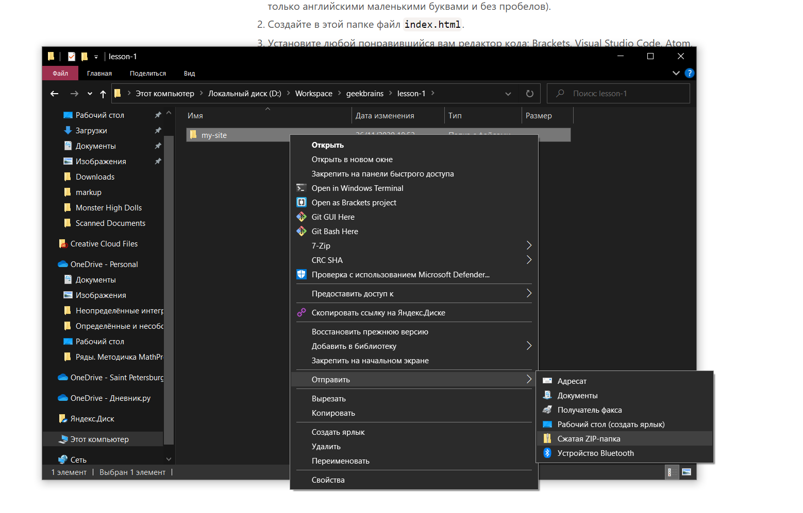

# Урок 1. Домашнее задание

1. Создайте папку на своём компьютере и назовите её `my-site` (можете назвать по-своему, только английскими маленькими буквами и без пробелов).
2. Cоздайте в этой папке файл `index.html`.
3. Установите любой понравившийся вам редактор кода: Brackets, Visual Studio Code, Atom, Notepad++, Submlime Text 3 и другие.
4. Откройте ваш `index.html` в вашем редакторе кода.
5. Укажите кодировку файла `UTF-8` через тег `<meta>`.
6. Напишите любой текст приветствия, например, `Привет, Мир`.
7. Зарегистрируйтесь на хостинге и разместите там ваш файл.
8. В качестве результатов работы пришлите zip-архив вашего файла и
   ссылку на сайт в интернете.

## Как сделать zip-архив

### Windows

Находим папку с нашим файлом `index.html`. Нажимаем правой кнопкой мыши и выбираем пункт `Отправить` и в нём выбираем `Сжатая zip-папка`.

### MacOS

Также находим нашу папку с файлом `index.html`. Нажимаем правой кнопкой мыши и выбираем пункт меню `Сжать`.
