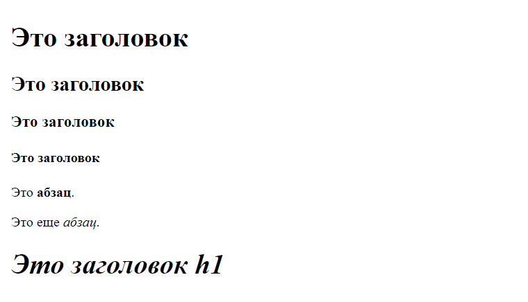
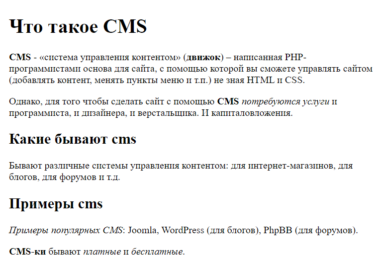
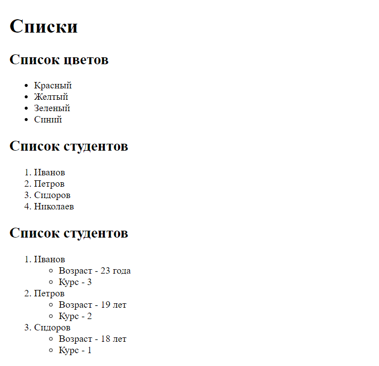
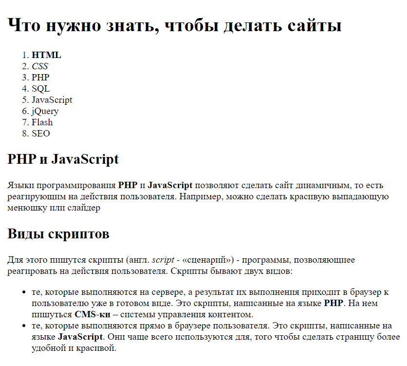

# Урок 2. Домашнее задание

Для каждого задания создайте отдельный html-файл с названием `task-*`, где вместо `*` напишите номер задания (`task-1.html`, `task-2.html` и т. д.). В каждом задание нужно будет повторить то, что будет изображено на картинке.

## Заголовки, жирность, курсив

### Задание 1

Надо сделать:



Текст для копирования:

```
Это заголовок

Это абзац.

Это еще абзац.

Это заголовок h1
```

### Задание 2

Надо сделать:



Текст для копирования:

```
Что такое CMS

CMS - «система управления контентом» (движок) – написанная PHP-программистами основа для сайта, с помощью которой вы сможете управлять сайтом (добавлять контент, менять пункты меню и т.п.) не зная HTML и CSS.

Однако, для того чтобы сделать сайт с помощью CMS потребуются услуги и программиста, и дизайнера, и верстальщика. И капиталовложения.

Какие бывают cms

Бывают различные системы управления контентом: для интернет-магазинов, для блогов, для форумов и т.д.

Примеры cms

Примеры популярных CMS: Joomla, WordPress (для блогов), PhpBB (для форумов).

CMS-ки бывают платные и бесплатные.
```

## Списки

### Задание 3

Надо сделать:



Текст для копирования:

```
Списки

Список цветов

Красный
Желтый
Зеленый
Синий

Список студентов

Иванов
Петров
Сидоров
Николаев

Список студентов

Иванов
Возраст - 23 года
Курс - 3

Петров
Возраст - 19 лет
Курс - 2

Сидоров
Возраст - 18 лет
Курс - 1
```

## Заголовки, абзацы и списки

### Задание 4

Надо сделать:



Текст для копирования:

```
Что нужно знать, чтобы делать сайты

HTML
CSS
PHP
SQL
JavaScript
jQuery
Flash
SEO

PHP и JavaScript

Языки программирования PHP и JavaScript позволяют сделать сайт динамичным, то есть реагирующим на действия пользователя. Например, можно сделать красивую выпадающую менюшку или слайдер

Виды скриптов

Для этого пишутся скрипты (англ. script - «сценарий») - программы, позволяющиее реагировать на действия пользователя. Скрипты бывают двух видов:

те, которые выполняются на сервере, а результат их выполнения приходит в браузер к пользователю уже в готовом виде. Это скрипты, написанные на языке PHP. На нем пишуться CMS-ки – системы управления контентом.
те, которые выполняются прямо в браузере пользователя. Это скрипты, написанные на языке JavaScript. Они чаще всего используются для, того чтобы сделать страницу более удобной и красивой.
```
