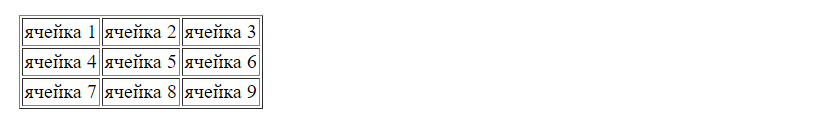
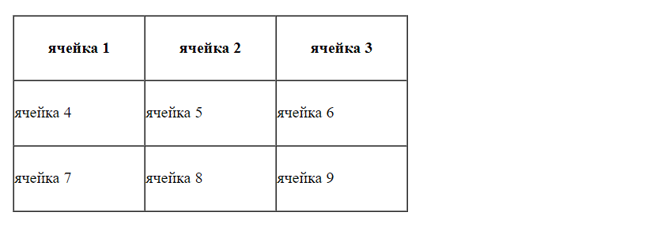
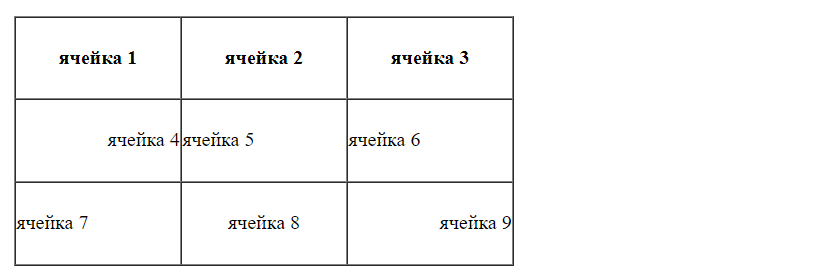
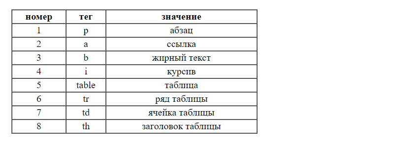
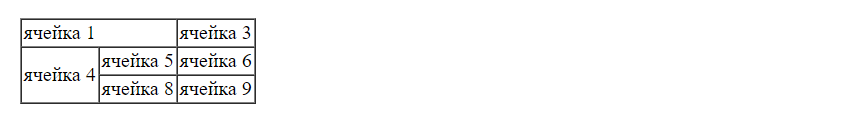
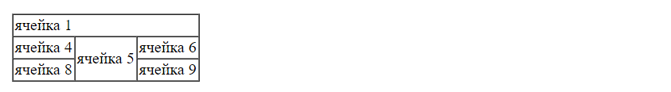
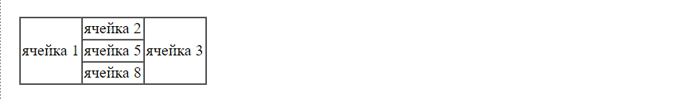
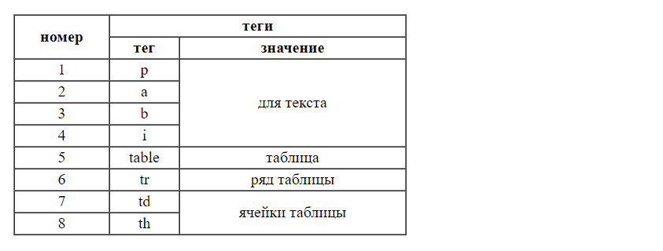

# Урок 3. Домашнее задание

Для каждого задания создайте отдельный html-файл с названием `task-*`, где вместо `*` напишите номер задания (`task-1.html`, `task-2.html` и т. д.). В каждом задание нужно будет повторить то, что будет изображено на картинке.

Напоминаю, что каждая страница должна содержать обязательный шаблон:

```html{lineNumbers: true}
<!DOCTYPE html>
<html lang="ru">
  <head>
    <meta charset="utf-8" />
  </head>
  <body>
    /* Пишем ваше задание исключительно в body, пожалуйста */
  </body>
</html>
```

## Простые таблицы

### Задание 1

Повторите страницу по данному образцу



### Задание 2

В этом задании попробуйте использовать вместо `td` в первой строчке таблицы `th`. Этот тег сделан для создания заголовков таблиц. Читать [здесь](https://webref.ru/html/th).

Для размера таблицы используйте атрибуты `width="400"` и `height="200"`. Для выравнивания текста по центру в ячейках `align="center"`.

Повторите страницу по данному по образцу:



### Задание 3

Используйте другие значения для `align`, а именно `left` и `right`.

Повторите страницу по данному по образцу:



### Задание 4

Повторите страницу по данному по образцу:



## Группировка столбцов и рядов

Вспомните про такие атрибуты у `td` как `colspan` и `rowspan`. Можете почитать [здесь](https://webref.ru/html/th/colspan) и [здесь](https://webref.ru/html/th/rowspan).

### Задание 5

Повторите страницу по данному по образцу:



### Задание 6

Повторите страницу по данному по образцу:



### Задание 7

Повторите страницу по данному по образцу:



### Задание 7

Повторите страницу по данному по образцу:


