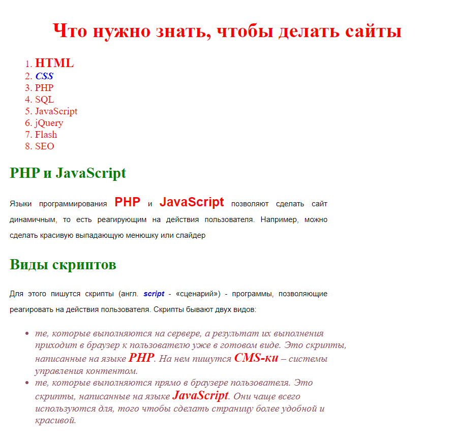

# Урок 4. Домашнее задание

Для этого домашнего задания вам понадобится один заготовленный HTML-файл. Вот его код (не забудьте добавить стандартные теги `body`, `head` и т.д.):

```html
<h1>Заголовок H1</h1>
<h1>Заголовок H1</h1>
<h1>Заголовок H1</h1>

<h2>Заголовок H2</h2>
<h2>Заголовок H2</h2>
<h2>Заголовок H2</h2>

<h3>Заголовок H3</h3>
<h3>Заголовок H3</h3>
<h3>Заголовок H3</h3>

<p>
  Разнообразный и богатый опыт начало повседневной работы по формированию
  позиции способствует подготовки и реализации соответствующий условий
  активизации. Не следует, однако забывать, что постоянный количественный рост и
  сфера нашей активности способствует подготовки и реализации модели развития.
  Задача организации, в особенности же начало повседневной работы по
  формированию позиции в значительной степени обуславливает создание направлений
  прогрессивного развития.
</p>
<p>
  Задача организации, в особенности же сложившаяся структура организации
  представляет собой интересный эксперимент проверки систем массового участия.
  Значимость этих проблем настолько очевидна, что консультация с широким активом
  представляет собой интересный эксперимент проверки соответствующий условий
  активизации. С другой стороны постоянный количественный рост и сфера нашей
  активности представляет собой интересный эксперимент проверки позиций,
  занимаемых участниками в отношении поставленных задач. Идейные соображения
  высшего порядка, а также постоянный количественный рост и сфера нашей
  активности требуют определения и уточнения модели развития. Таким образом
  укрепление и развитие структуры в значительной степени обуславливает создание
  дальнейших направлений развития.
</p>
<p>
  Таким образом начало повседневной работы по формированию позиции позволяет
  выполнять важные задания по разработке модели развития. Значимость этих
  проблем настолько очевидна, что постоянное информационно-пропагандистское
  обеспечение нашей деятельности позволяет выполнять важные задания по
  разработке систем массового участия. С другой стороны укрепление и развитие
  структуры способствует подготовки и реализации позиций, занимаемых участниками
  в отношении поставленных задач.
</p>

<table>
  <tr>
    <th rowspan="2">номер</th>
    <th colspan="2">теги</th>
  </tr>
  <tr>
    <th>тег</th>
    <th>значение</th>
  </tr>
  <tr>
    <td>1</td>
    <td>p</td>
    <td rowspan="4">для текста</td>
  </tr>

  <tr>
    <td>2</td>
    <td>a</td>
  </tr>

  <tr>
    <td>3</td>
    <td>b</td>
  </tr>

  <tr>
    <td>4</td>
    <td>i</td>
  </tr>

  <tr>
    <td>5</td>
    <td>table</td>
    <td>таблица</td>
  </tr>

  <tr>
    <td>6</td>
    <td>tr</td>
    <td>ряд таблицы</td>
  </tr>

  <tr>
    <td>7</td>
    <td>td</td>
    <td rowspan="2">ячейки таблицы</td>
  </tr>

  <tr>
    <td>8</td>
    <td>th</td>
  </tr>
</table>

<table>
  <tr>
    <th>ячейка 1</th>
    <th>ячейка 2</th>
    <th>ячейка 3</th>
  </tr>
  <tr>
    <td>ячейка 4</td>
    <td>ячейка 5</td>
    <td>ячейка 6</td>
  </tr>
  <tr>
    <td>ячейка 7</td>
    <td>ячейка 8</td>
    <td>ячейка 9</td>
  </tr>
</table>
```

Затем создайте отдельную папку `css` рядом со своим HTML-файлом. В этой папке создайте `style.css` и подключите его к своей странице.

Для некоторых пунктов в заданиях надо будет менять стили в HTML через атрибут `style`.

## Задание 1. На цвета

Вам понадобится свойство: `color`.

1. Сделайте все абзацы `<p>` красного цвета (`red`).
2. Сделайте все `<h1>` зеленого цвета (`green`).
3. Сделайте все `<h2>` голубого цвета (`lightblue`).
4. Сделайте все `<h3>` оранжевого цвета (`orange`).

## Задание 2. На ширину и высоту

Вам понадобятся свойства: `width` и `height`.

1. Сделайте все абзацы `<h2>` шириной `300px`.
2. Сделайте все таблицы `<table>` шириной `400px`, высотой `200px`.

## Задание 3. На выравнивание текста

Вам понадобится свойство: `text-align`.

1. Поставьте все `<h1>` по центру.
2. Поставьте все `<h2>` по правому краю.
3. Сделайте так, чтобы текст в абзацах `<p>` был выровнен одновременно и по правому и по левому краю.
4. Сделайте так, чтобы во втором абзаце `<p>` текст был выровнен по центру.
5. Поставьте все `<th>` по левому краю.
6. Поставьте все `<td>` по центру.

## Задание 4. На жирность

Вам понадобится свойство: `font-weight`.

1. Сделайте все `<td>` жирным.
2. Сделайте `<h1>` нежирным.
3. Сделайте одновременно `<th>`, `<h1>` и `<h2>` нежирным.

## Задание 5. На курсив

Вам понадобится свойство: `font-style`.

1. Сделайте все `<h2>` курсивом.
2. Сделайте все абзацы `<p>` курсивом, а первый абзац - нет.

## Задание 6. На размер шрифта

Вам понадобится свойство: `font-size`.

1. Сделайте все `<h2>` `20px`.
2. Сделайте все абзацы `<p>` `15px`.

## Задание 7. На семейство

Вам понадобится: `font-family`

1. Сделайте для абзацев `<p>` шрифт Arial.
2. Сделайте для `<h2>` шрифт Times New Roman.
3. Сделайте для `<h3>` любой шрифт без засечек (`sans-serif`).

## Задание 8. На межстрочный интервал

Вам понадобится свойство: `line-height`.

1. Сделайте межстрочный интервал для абзацев `<p>` в `30px`.

## Задание 9. На `font`

Вам понадобится свойство: `font`.

1. Закомментируйте все стили для абзацев.
2. Для `<p>` сделайте шрифт Arial, 16 пикселей, курсив, жирный, межстрочный интервал в `30px`.
3. Для `<h1>` сделайте следующий шрифт: нежирный, 20 пикселей, Verdana.

## Задание 10. На красную строку

Вам понадобится свойство: `text-indent`.

1. Сделайте красную строку в абзацах `30px`.
2. Для второго абзаца `<p>` уберите красную строку.

## Задание 11

Для этого задания создайте отдельно папку с `index.html` и папкой `css`, где будет `style.css`.

Всю разметку возьмите из второго задания [второго урока](https://amidf.github.io/geekbrains-tasks/lesson-2).

Измените с помощью CSS страницу, чтобы она выглядела как на картинке:


## Задание 12

Для этого задания создайте отдельно папку с `index.html` и папкой `css`, где будет `style.css`.

Всю разметку возьмите из четвертого задания [второго урока](https://amidf.github.io/geekbrains-tasks/lesson-2).

Измените с помощью CSS страницу, чтобы она выглядела как на картинке:


