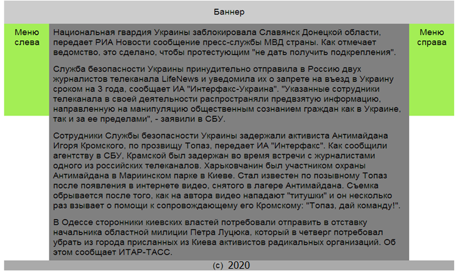
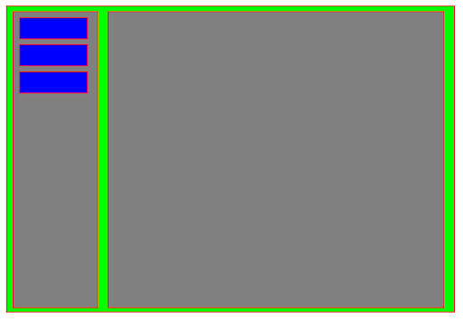
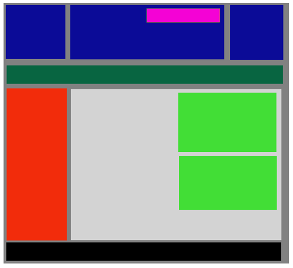
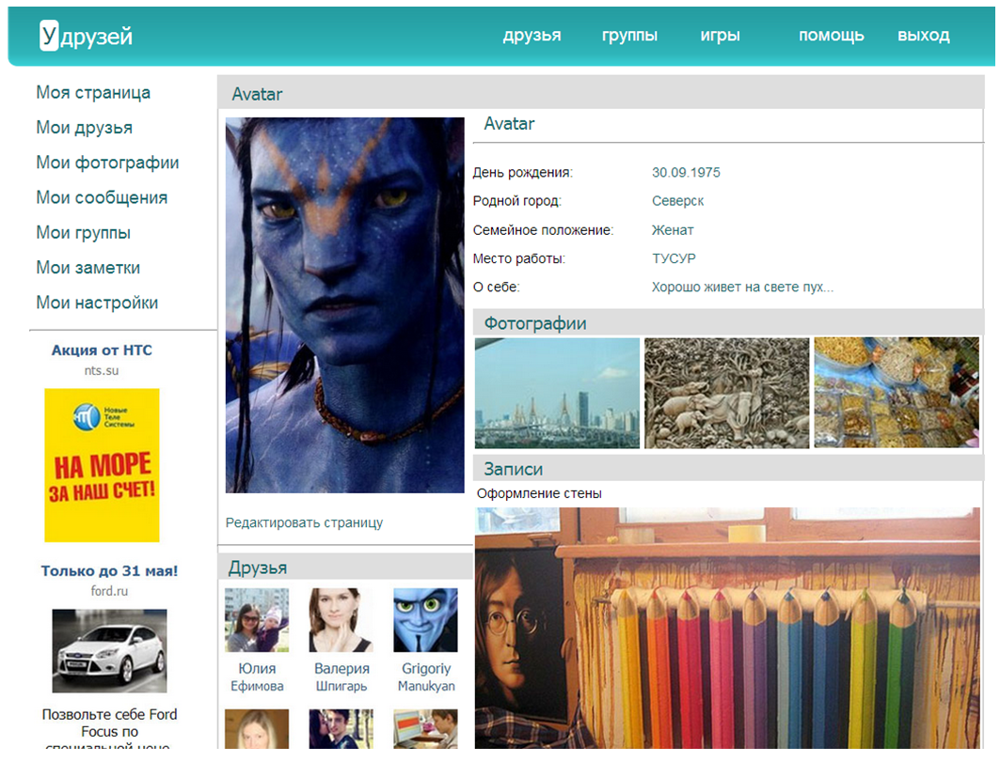

# Урок 6. Домашнее задание

На этот раз задания 1 и 2 обязательные, а 3 и 4 по желанию.

## Позиционирование по центру

Для позиционирования вашего сайта по центру используйте следующий подход. Создайте на странице отдельный `div` с классом `wrapper`.

```html
<!DOCTYPE html>
<html lang="ru">
  <head>
    <meta charset="utf-8" />

    <title></title>
  </head>
  <body>
    <div class="wrapper"></div>
  </body>
</html>
```

И с в стилях сделайте следующее правило:

```css
.wrapper {
  width: 600px;
  margin: 0 auto;
}
```

Потом все блоки вашего сайта поместите в этот `div`.

## Задание 1

Используя `float: right;` и `float: left;` соберите следующий макет сайта. Цвета можно использовать свои, главное структура. Текст тоже можете подставить свой.



## Задание 2

Используя полученные знания на уроке, сверстайте следующую структуру. Желательно чтобы не применялось абсолютное позиционирование. А для меню используйте список, сделав его элементы блочными. Цвета можете взять свои, высоту можно указывать через `height`.



## Задание 3\*

Если предыдущее задание покажется простым, сверстайте структуру посложнее.
Здесь уже допустимо абсолютное позиционирование для этого блока.
Постарайтесь использовать `float` для боковых элементов.



## Задание 4\*

Начните верстать следующий макет. Это задание на 2 урока.



Картинки можно скачать здесь: [ссылка](https://d2xzmw6cctk25h.cloudfront.net/asset/2112941/attachment/a435ccf72192598aea5c76521cb89205.zip)
