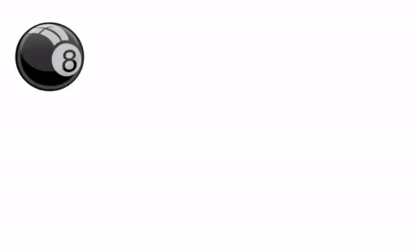
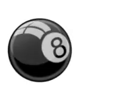
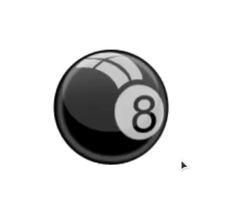

# Урок 9. Домашнее задание

В этом домашнем задании потренируйтесь в создании анимаций.

Здесь вы можете скачать изображения: <a href="./images/images.zip" download>images.zip</a>

Возьмите любое понравивишееся изображение и выполните следующие задания.

## Задание 1. `@keyframes`

Создайте с помощью `@keyframes` простейшую анимацию, по желанию. Например, так выглядит анимация, которая перемещает мячик влево:



```css
img {
  position: relative;
  animation-name: myAnimation;
  animation-duration: 2s;
}

@keyframes myAnimation {
  from {
    left: 0;
  }

  to {
    left: 500px;
  }
}
```

Вместо картинки можете использовать, например, `div` и изменять у него цвет фона или размер.

## Задание 2. `transform`

Сделайте похожие анимации, используя `@keyframes`, а также свойство `transform`.

### Переворот на 360 градусов

Для данной анимации вам понадобится функция `rotate`.



### Увеличение картинки в 2 раза

Для данной анимации используйте функцию `scale`.



## Задание 3

Скачайте примеры с различными анимациями и попробуйте придумать что-то своё.

Примеры: <a href="./images/examples.zip" download>examples.zip</a>
